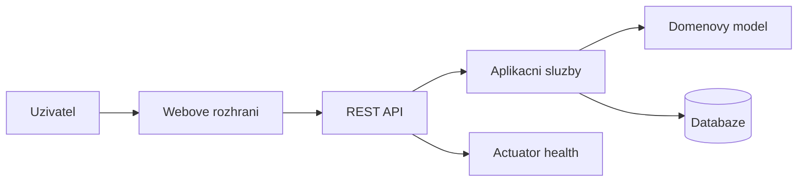
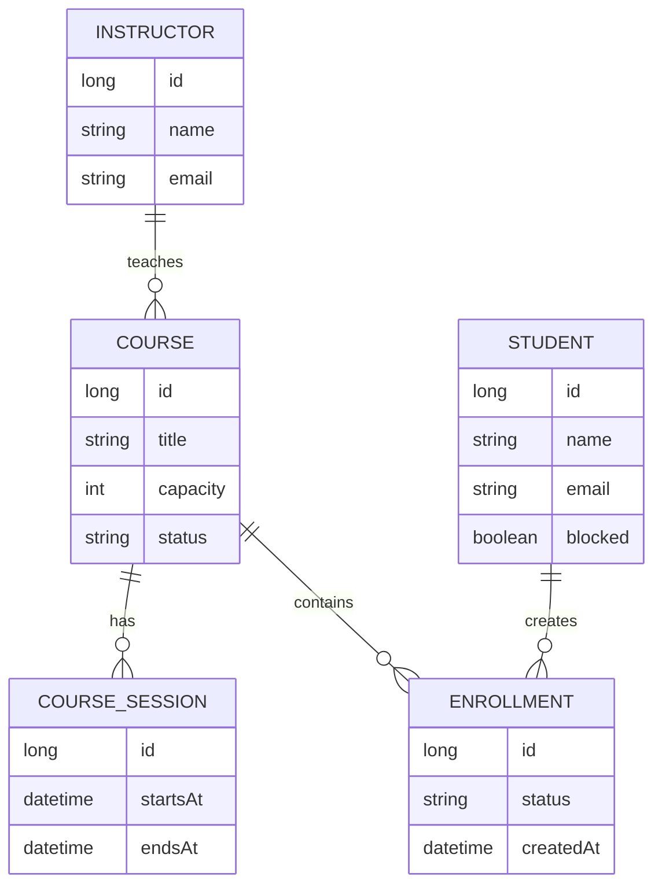

# SDD - Software Design Document

## 1. Ucel dokumentu

Tento dokument popisuje technicky navrh aplikace Course Reservations. Cilem je vysvetlit vrstvy systemu, hlavni komponenty, datovy model, API, bezpecnost a nasazeni.

## 2. Prehled architektury

Aplikace je monoliticka webova aplikace postavena na Spring Boot. Frontend je jednoducha staticka aplikace v HTML, CSS a JavaScriptu, ktera komunikuje s backendem pres REST API.



## 3. Vrstvy aplikace

### 3.1 Webova vrstva

Balicek: `cz.semester.courseapp.http`

Odpovednosti:

- prijem HTTP pozadavku
- validace vstupnich DTO
- prevod domenovych objektu na response DTO
- jednotne zpracovani chyb
- vystaveni Swagger dokumentace

Hlavni tridy:

- `CourseController`
- `ApiExceptionHandler`
- request/response recordy
- `OpenApiConfig`

### 3.2 Aplikacni vrstva

Balicek: `cz.semester.courseapp.app`

Odpovednosti:

- rizeni use-case logiky
- autentizace a autorizace
- prace s repository
- koordinace domenoveho modelu
- volani notifikacni brany

Hlavni tridy:

- `CourseService`
- `AuthSessionService`
- `UserSession`
- `NotificationGateway`

### 3.3 Domenova vrstva

Balicek: `cz.semester.courseapp.domain`

Odpovednosti:

- entity aplikace
- business pravidla
- stavove prechody
- kontrola konzistence kurzu a zapisu

Hlavni entity:

- `Course`
- `CourseSession`
- `Student`
- `Instructor`
- `Enrollment`

### 3.4 Infrastrukturni vrstva

Balicek: `cz.semester.courseapp.infra`

Odpovednosti:

- Spring Data repository
- seed data pro lokalni beh
- jednoducha notifikacni implementace do logu

## 4. Datovy model



## 5. Stav kurzu

Kurz muze byt ve dvou stavech:

- `DRAFT` - koncept, student ho nevidi jako dostupny kurz
- `PUBLISHED` - publikovany kurz, student se muze prihlasit

Publikace je povolena pouze v pripade, ze kurz obsahuje alespon jeden termin.

## 6. Stav zapisu

Zapis muze byt ve dvou stavech:

- `ENROLLED` - student je zapsany
- `WAITLISTED` - student je na cekaci listine

Pri naplneni kapacity se dalsi studenti presouvaji na cekaci listinu. Po zruseni zapisu se prvni cekatel automaticky zapise.

## 7. REST API

Hlavni endpointy:

- `POST /api/auth/login`
- `GET /api/state`
- `POST /api/students`
- `PATCH /api/students/{id}/blocked`
- `POST /api/instructors`
- `POST /api/courses`
- `POST /api/courses/{id}/sessions`
- `POST /api/courses/{id}/publish`
- `PATCH /api/courses/{id}/capacity`
- `DELETE /api/courses/{id}`
- `POST /api/courses/{id}/enroll`
- `DELETE /api/courses/{courseId}/enrollments/{studentId}`

Podrobny prehled je dostupny ve Swagger UI.

## 8. Autentizace a autorizace

Po prihlaseni vznikne serverova session reprezentovana tokenem. Frontend posila token v HTTP hlavicce `X-Auth-Token`.

Opravneni:

- administrator ma pristup ke vsem spravnim operacim
- vyucujici muze spravovat pouze svoje kurzy
- student muze pracovat pouze se svym zapisem

## 9. Frontend

Frontend je ulozen ve slozce `src/main/resources/static`.

- `index.html` definuje strukturu obrazovek
- `styles.css` definuje vzhled
- `app.js` obsahuje klientskou logiku, volani API a renderovani UI

Frontend rozlisuje role a podle role skryva nebo zobrazuje odpovidajici casti rozhrani.

## 10. Chybove stavy

Chyby se prevadi na konzistentni JSON odpoved:

```json
{
  "message": "Popis chyby"
}
```

Pouzivane HTTP kody:

- `400 Bad Request` pro nevalidni vstup
- `401 Unauthorized` pro chybejici nebo neplatne prihlaseni
- `403 Forbidden` pro nedostatecne opravneni
- `404 Not Found` pro neexistujici zdroj
- `409 Conflict` pro poruseni business pravidla

## 11. Nasazeni

Aplikace je pripravena pro:

- lokalni spusteni pres Maven
- lokalni kontejnerovy beh pres Docker Compose
- nasazeni do Kubernetes pomoci Kustomize overlayu

## 12. Provoz a monitoring

Pro kontrolu stavu slouzi Spring Boot Actuator endpoint:

- `/actuator/health`

Provoz se opira o strukturovane logy aplikace a Kubernetes health kontroly.
