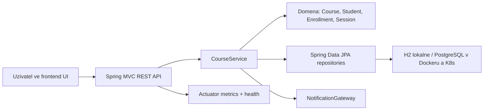

# Architektura

## Vrstvy

- `domain` obsahuje entity a business pravidla. Zde je hlavni TDD jadro.
- `app` obsahuje aplikační service, transakce a port `NotificationGateway`.
- `infra` obsahuje JPA repository, logovaci notifikace a seed data.
- `http` obsahuje REST controller, DTO a chybove odpovedi.
- `static` obsahuje frontend bez build kroku.

## Datove toky

1. Frontend vola REST endpointy pod `/api`.
2. Controller validuje request DTO a vola `CourseService`.
3. Service nacte entity z repository, spusti domenovou operaci a transakcne ulozi stav.
4. Actuator poskytuje health checky a Prometheus metriky.
