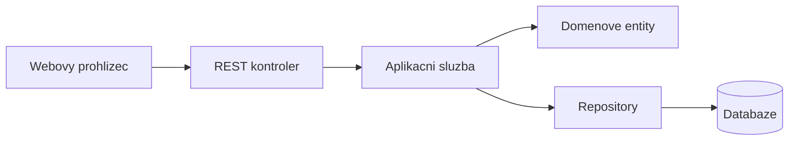

# Architektura

Aplikace je postavena jako Spring Boot monolit s jednoduchym statickym frontendem.

## Vrstvy

- `http` - REST kontrolery, request/response DTO, zpracovani chyb a Swagger konfigurace
- `app` - aplikacni sluzby, prihlaseni, opravneni a koordinace use-casu
- `domain` - entity a business pravidla
- `infra` - repository, seed data a technicke implementace
- `static` - HTML, CSS a JavaScript frontend

## Datovy tok

## Databaze

Pro lokalni vyvoj lze pouzit H2. Pri behu pres Docker Compose je pouzita PostgreSQL databaze.

## Bezpecnost

Po prihlaseni vznikne token. Frontend ho posila v hlavicce `X-Auth-Token`. Backend podle tokenu overuje roli uzivatele a jeho opravneni k jednotlivym operacim.
